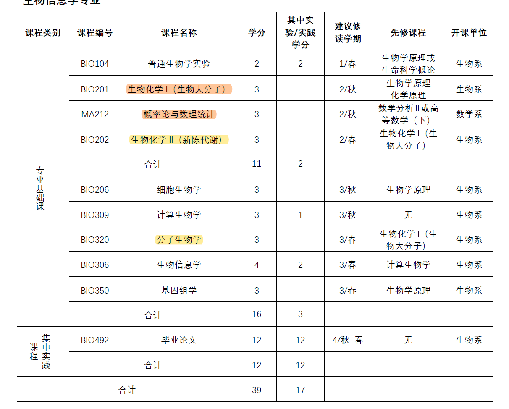
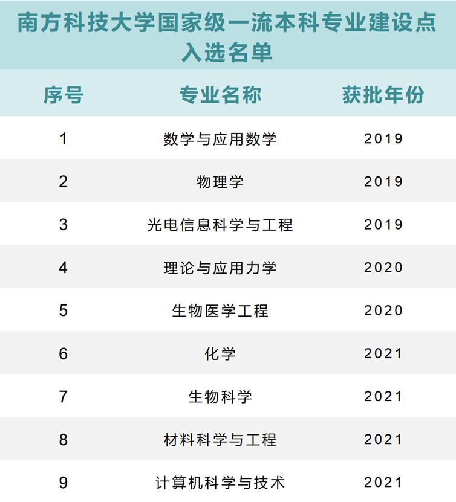
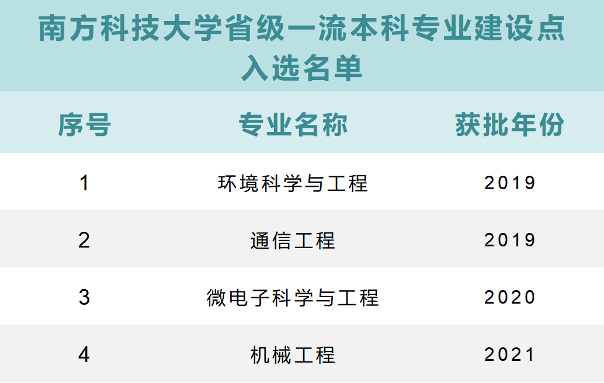
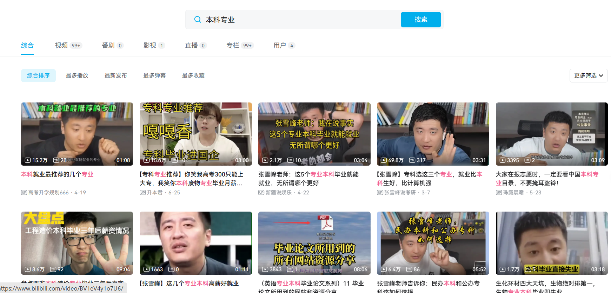
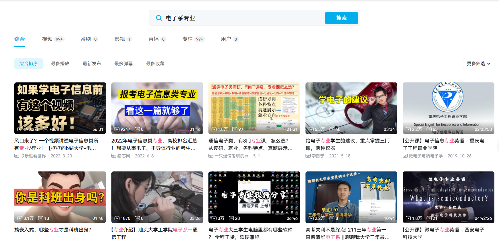
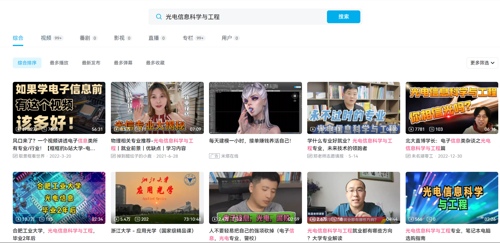
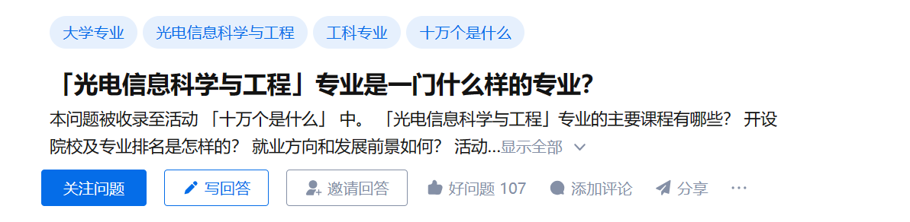
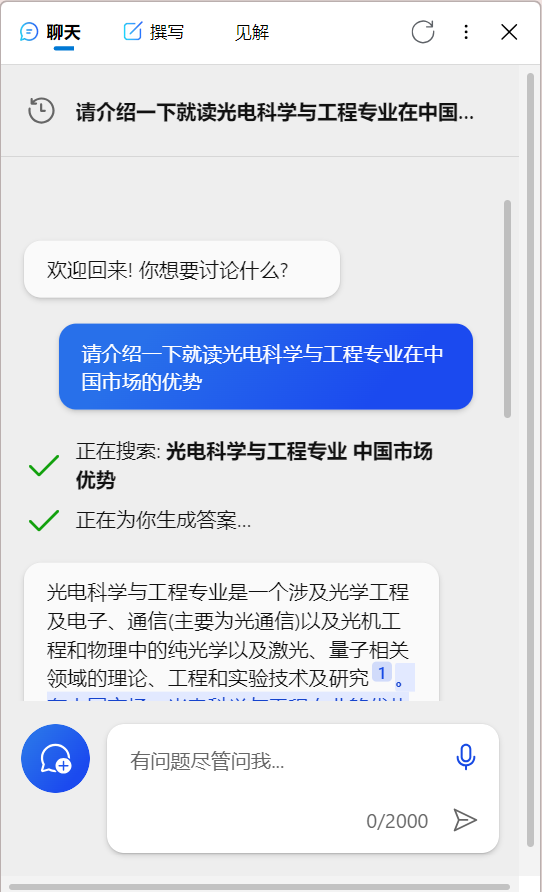

# 选专业

## 思路

### 因素
下面三条因素不分先后，同等重要：
1. 兴趣
2. 能力
3. 社会需求

首先，只有热爱能抵岁月漫长。如果没有兴趣在此，专业课程还可以对付，要跟着教授做研究，比黄连还苦。特别是选择深造的同学，或早或晚都要进实验室，没有兴趣支撑起研究生涯，岂不是十分黑暗。其次，充分考虑专业前景。研究相关行业的增长趋势和就业率，以确定你选择的专业是否有稳定的就业机会和发展潜力。第三，提前了解该专业有什么发展资源，比如交流项目。

### 1+3和2+2
1+3指第一年结束时进专业，3年后毕业；2+2指第二年结束时进专业，2年后毕业。
最主要的区别其实就两个，即院系资源和“转”专业难度。如果2+2，晚一年进专业，显然院系资源会少一些，但是等到大二结束选专业的时候会比到时候转专业简单不少。1+3则相反。

### 流程
如果你上面三者都想的很透彻，也就不用看这一部分了。但是显然，几乎没有人能做到在高考完后想明白这些。
#### Step 0: 确定路线
啥意思，就是如果你有了大致的选择，先在后续大学生活中确定这个选择适不适合自己；如果不适合，再考虑其他的选择。
如果没有大致的方向，按照排除法，逐步缩小。
#### Step 1: 根据三条因素考虑
根据你了解到的信息，挨个考虑验证（了解渠道推荐在____）。
兴趣，这个需要你了解自己，同时也要你增加体验。找到兴趣的最理想的状态是：你的内心告诉你是它。很玄乎是吧，有些表现也能体现出来，比如你每天都会充满动力地想做它。同时，还有另外一个就是考虑这个兴趣是不是错觉，是否经得起时间的考验。
能力，大学的课堂，科研，工作等等都是非常好的机会去发现自己的能力，探索自己的边界。所以，需要多去体验。
社会需求，这个需要搜集信息，具体的方法在_____有提到。
#### Step 2: 权衡
上一步应该已经可以解决有大致选择的学弟学妹的问题了。因此，这一步是针对做排除法的学弟学妹的。
如果在大一有按照第一步做，那么在大一的最后两个月，你应该会在几个专业间犹豫，这里提供几个可行的权衡因素：
- 专业资源
  - 比如这个专业如果人很多，那么人均资源就会相对少一些。
- 导师
  - 如果有导师是你感觉很好的，那这是一个很大的加分项。
- 出路
  - 比如就业前景，升学难度等等
- 通用性
  - 如果最终仍然没有确定，那么选择尽量通用的专业，也是一个可选项。

&emsp;

## 渠道

### 从业者
这里的从业者包括教授们。从他们那里能得到的主要信息是这个专业概况，以及以后能做什么。但是缺点很明确，可能有些从业者的视角有偏见；同时，可能有些信息会因为从业者的视角而过时。

### 学长学姐
他们能够提供学习情况，学习难度，科研情况等信息，而且是非常新鲜的信息。但是同样，因为学长学姐只早进了这个专业几年，信息会非常有限。

### 培养方案
培养方案不需要去和人聊天，对内向的孩子很友好。同时，培养方案中的信息非常全面。

以我这一届的生物信息学培养方案为例。专业必修课可以给你初步的筛选方法，如果有些专业必修课你一看就头大，直接pass（如果看不懂这个课的名字，上网查可以找到人话）。专业选修课可以帮助你知道这个专业有哪些细分的方向。同样，前面的一些专业介绍，不同专业对比也能看出一些端倪。最后，培养方案中的课程安排，学分要求，毕业要求等等，也是你可以考虑的信息。

### 一流专业列表

    <table class="image-container">
        <tbody>
            <tr>
                <td style="width: 50%;">
                    
                </td>
                <td style="width: 50%;">
                    
                </td>
            </tr>
        </tbody>
    </table>

南科大有一批专业已有了“国家一流专业”或者“省一流专业”的称号，快来看看，有没有你感兴趣的呢？

截至目前（2023年7月14日），南科大数学学科入选“双一流”建设学科名单，共获批九个国家级一流本科专业建设点：数学与应用数学、物理学、光电信息科学与工程、理论与应用力学、生物医学工程、化学、生物科学、材料科学与工程、计算机科学与技术。此外，还获批4个省级一流本科专业建设点：环境科学与工程、通信工程、微电子科学与工程、机械工程。

### 专业推介会
在大一的下学期，书院将会组织各个专业的专业推介会，届时只需要新朋友们选择参加想要了解的专业的推介会，就能与教授面对面，了解该专业的第一手信息。

### 午餐推介会
专业推介会固然好，但如果心仪了热门的专业，推介会教室将被人人人人挤满，能向教授提问的机会也不多，缺少了面对面交流的机会。如果你想进一步了解某个专业，午餐推介会你不要错过啦。

午餐推介会，顾名思义，教授在与同学们吃午饭的过程中对某专业进行一个深入的探讨，还能给同学们答疑解惑。午餐推介会一般为报名制，每一餐大约限制为15名同学，边吃边聊的机会，你不心动吗？

### 网络工具
大多数的推介会都举办在大一下学期的下半学期，这个时候很多同学们都已经有了心仪的专业，这些兵贵神速的同学们是怎么找到专业的具体信息的呢？让我们借助网络工具来实现：
#### B大是个好地方

<table class="image-container">
    <tbody>
        <tr>
            <td style="width: 20%;">
                
搜素“本科专业怎么选”；

            </td>
            <td style="width: 80%;">
                
            </td>
        </tr>
        <tr>
            <td style="width: 20%;">
                
搜索院系专业，方便横向对比；

            </td>
            <td style="width: 80%;">
                
            </td>
        </tr>
        <tr>
            <td style="width: 20%;">
                
直接搜索专业名称，坑不坑一眼便知；还有一些up，会出系统的视频来讲每个专业。

            </td>
            <td style="width: 80%;">
                
            </td>
        </tr>
    </tbody>
</table>

#### 知乎

#### AI

<table class="image-container" style="width: 50%;">
    <tbody>
        <tr>
            <td>
                <i>这个适合你了解一定信息之后，因为你需要有一定的判断能力来判断它给出的答案的准确性。</i>
            </td>
        </tr>
        <tr>
            <td>
                

                    
                

            </td>
        </tr>
    <tbody>
</table>

&nbsp;

## 学长学姐说

### by 王子睿（生物信息学专业）

这里我就讲讲我选专业的思路吧。我是带着大致的方向来的妮可（对生物的兴趣），而这个大致的方向是从小有的，并且在我之前的教育阶段不断确定。所以，我在刚到妮可的时候就去确认生物这个方向适不适合我。

大一秋有三门课帮助我确认专业。一个是大物，我大物学得很不顺畅，云里雾里的，所以让我确认了妮可的相当一部分工科不适合我。第二个是高数，与大物相反，高数我不仅学得很舒服，而且时常能根据课上内容脑洞到一些非高数的数学知识，所以这让我有胆量去碰一些涉及数学的专业。第三个是Python，Python学得也很顺畅，尤其是一些思维层面的，这门课既启发了我很多，也让我意识到了我在一些编程的思维方面有些优势。

但是直到此时，还有一个很重要的没有确定，生物呢？这是大一春我和一位研究生学长聊天时确认的。他提了一嘴自己适合学生物是因为生物这种需要大量模糊记忆的刚好就是他擅长的。后来我回想了一下自己，确实这方面的能力大大帮助了自己在初高中时学习生物。

至此，答案已经呼之欲出了。再考虑最后一个因素，社会需求。~~21世纪是生物的世纪。~~ 考虑生物信息学作为一个交叉学科，在这个合作越来越重要的时代，这种交叉学科的需求是不会减少的。而且，生物信息学也不会局限于科研，它也会在医药，治疗器械企业等领域发挥作用。所以，我最终选择了生物信息学。

我很幸运地是带着方向来，并且最终确认了自己的方向。但是，我也有一些朋友是没有方向的，他们的选择过程就更加复杂了。但是，我觉得他们的选择过程也是非常有意思的，所以我也想分享一下。

以一个为例。他最终选的是信息工程，电子系的。他选南科大的一个重要原因就是大一不分专业。我这里知道的是他大一秋听了不少宣讲会。但是仍然未决定。等到寒假回来，他说他要去~~寄~~计系，原因就是计算机这个专业很通用，等到三年后他毕业的时候，有更多筹码选他到时候喜欢的专业。但是后来他看到培养方案进系要求做不到，于是去考虑其他同样通用的专业。这期间我知道他找了一些教授，可能还有一些学长学姐。最终他选了信息工程。值得一提的是他仔细研读了信息工程的培养方案，确实挖掘出了不少信息，而且他嗨对专业选修课进行了一些选秀的排序，方便以后选课。

### by 叶思源（光电信息科学与工程）
就业or创业or深造？专业可能会给你一些“指导”。在南科大，同学们普遍认为，大部分的专业是需要进行深造才能得到一份与专业相关的工作，这也是很多学长学姐都选择了深造的原因。但也可能有一些例外，如，计算机系的同学可以在毕业后成为一名光荣的程序猿，读生医工的同学也可能受到投资公司的青睐。更多的可能，留给大家探索。选择专业时，四年后的发展方向也可能成为你做出选择的理由哦。
