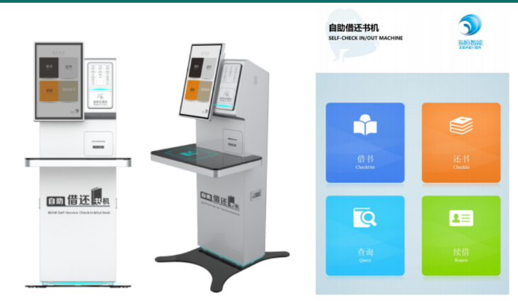

# 学习资源
<!-- 待补充 -->
## 图书馆
### 图书馆借还书籍

在图书馆借书还书等操作都可以在自助借还书机上完成

#### 借还书机位置：

<table style="margin-left: 0.4rem">
  <colgroup>
    <col style="width: 42%" />
    <col style="width: 57%" />
  </colgroup>
  <thead>
    <tr class="header">
      <th>图书馆</th>
      <th>位置</th>
    </tr>
  </thead>
  <tbody>
    <tr class="odd">
      <td rowspan="2">琳恩</td>
      <td>一楼2台</td>
    </tr>
    <tr class="even">
      <td>三楼1台</td>
    </tr>
    <tr class="odd">
      <td rowspan="2">一丹</td>
      <td>一楼1台</td>
    </tr>
    <tr class="even">
      <td>二楼2台</td>
    </tr>
  </tbody>
</table>

#### 操作流程：
1. 借书
   1. 将需要借阅的图书放置于感应区;点击"借书";刷校园卡。
   2. 屏幕显示借阅文献数量;核对无误后点击"一键借书"即可。
2. 还书
   1. 将需要归还的图书放置于感应区;点击"还书"。
   2. 屏幕显示归还文献数量;核对无误后点击"一键还书"即可。
   3. 将已办理归还手续的图书放到移动还书箱中。
3. 续借
   1.  点击"续借";刷校园卡；
   2.  屏幕显示借阅信息;选择需要续借的图书，点击"续借"即可。